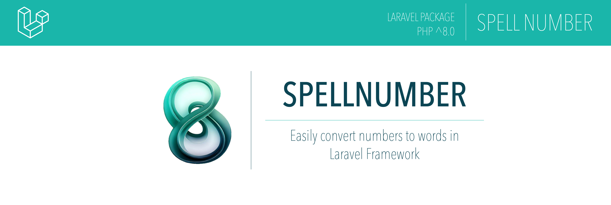

## Introduction

Easily convert numbers to words in Laravel using this library, which leverages the native `PHP INTL` extension to perform conversion effortlessly. With this library, you can convert numbers to words in various languages and also obtain the value in currency format according to the selected language. Supported languages include English, Spanish, Portuguese, French, Italian, Romanian, Hindi, Polish and Persian (Farsi).

**This library is compatible with PHP +8.0 and Laravel versions 8.0 and higher**
